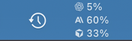
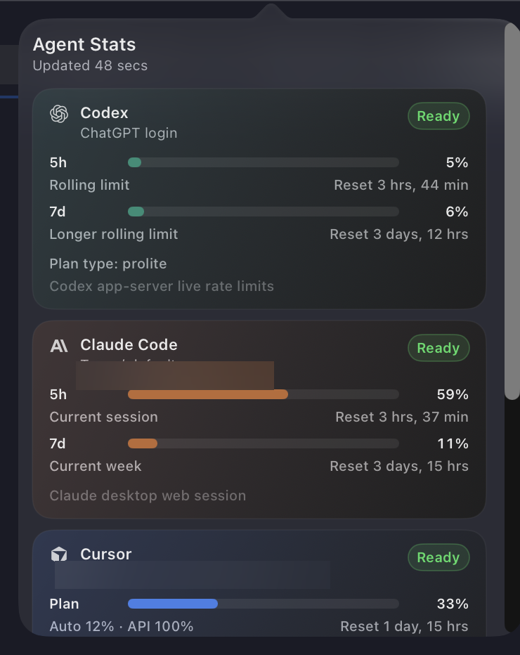
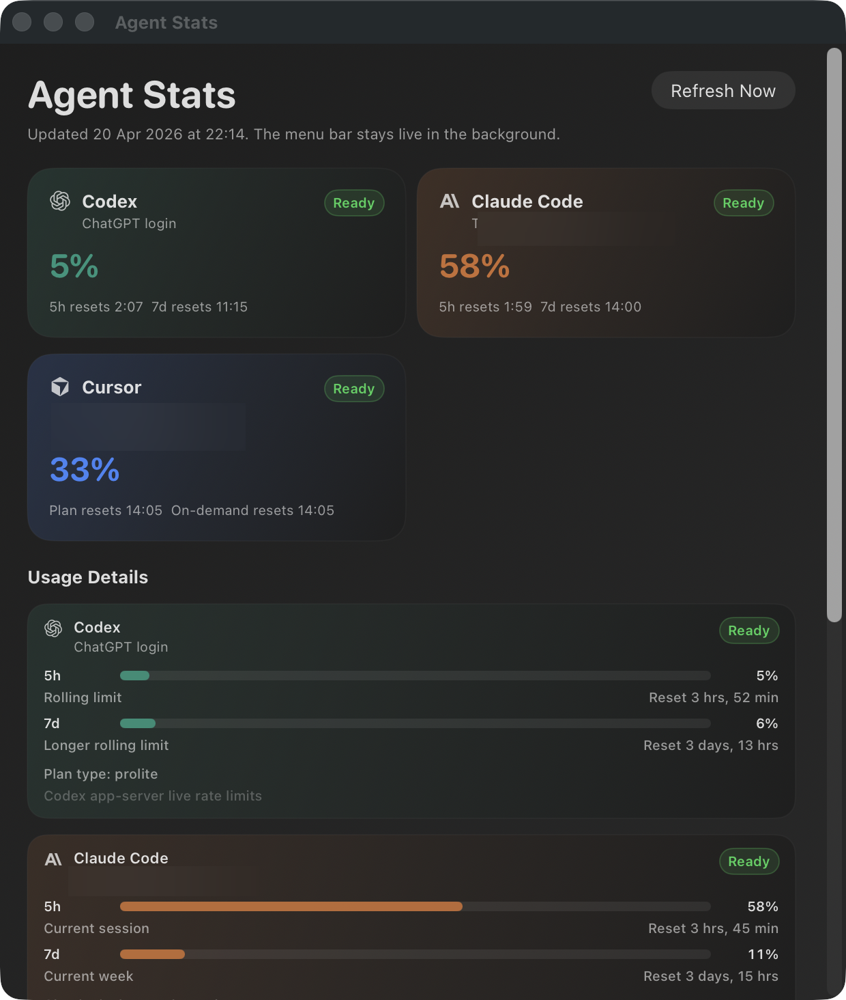

# Agent Stats


A lightweight macOS menu bar app for tracking **Codex**, **Claude Code**, and **Cursor** usage in one place.

Agent Stats is built for people who use more than one AI coding tool and want one fast place to check limits, resets, and current usage without bouncing between separate apps and dashboards.

## Screenshots

| Menu bar | Popover | Dashboard |
| --- | --- | --- |
|  |  |  |

## Why install it?

- **One place for three services** instead of checking each app separately.
- **A quick menu bar readout** for day-to-day usage checks.
- **A full dashboard** for resets, rolling windows, and setup state.
- **Launch at login** so it stays available in the background.
- **Local-first behavior** that reuses existing sessions and local state on your Mac.

## Download

Grab the latest release from **[GitHub Releases](https://github.com/pikpok/agent-stats/releases/latest)**.

The downloadable app bundle is unsigned, so on first launch macOS may ask you to confirm that you want to open it.

## Requirements

- macOS 14 or newer
- At least one of: Codex, Claude Code, or Cursor already set up on the Mac where you want to use Agent Stats

## What you get

- A menu bar app that keeps usage visible throughout the day
- A dashboard window with per-service details and reset timing
- A choice between `5h` and `5h + 7d` menu bar display modes
- Support for background refresh and launch at login

## What it tracks

| Service | What Agent Stats shows |
| --- | --- |
| Codex | Recent local rate-limit snapshots, including short and weekly windows |
| Claude Code | Desktop-session usage when available, with a local helper fallback |
| Cursor | Local session/auth state plus dashboard usage windows |

## Privacy / how it works

Agent Stats does **not** require a custom backend or a separate sign-in flow. It reads local app state, existing sessions, and provider usage data available on your Mac.

- Claude uses existing desktop session data where possible.
- Claude can also use a small local helper that writes usage data into `~/.claude/agent-stats/usage.json`.
- The app is designed to stay useful without adding another service to trust.

## Install from source

### Run from source

```bash
swift build
swift run AgentStatsBar
```

### Build the standalone app

```bash
./scripts/build-app.sh
open "dist/Agent Stats.app"
```

The app bundle name is **Agent Stats**; the Swift package/app target name is `AgentStatsBar`.

### Install with launch support

```bash
./scripts/build-app.sh --install
```

## Claude setup

Agent Stats includes a helper installer that writes Claude's local statusline payload to `~/.claude/agent-stats/usage.json`.

Install it once:

```bash
swift run AgentStatsBar --install-claude-helper
```

Then open Claude Code and send a message. After the next turn, Agent Stats should have fresh Claude usage data.

If you already have a custom `statusLine.command`, the installer will not overwrite it.

## Launch at login

You can toggle launch at login from the dashboard or with the CLI.

```bash
swift run AgentStatsBar --enable-launch-at-login
swift run AgentStatsBar --disable-launch-at-login
swift run AgentStatsBar --launch-at-login-status
```

When enabled from the bundled app, Agent Stats creates a LaunchAgent at:

```text
~/Library/LaunchAgents/com.pikpok.AgentStatsBar.plist
```

For the most stable setup, enable launch at login from the built `.app` bundle rather than from `swift run`.

## CLI commands

```bash
swift run AgentStatsBar --dump-snapshot
swift run AgentStatsBar --install-claude-helper
swift run AgentStatsBar --enable-launch-at-login
swift run AgentStatsBar --disable-launch-at-login
swift run AgentStatsBar --launch-at-login-status
```

`--dump-snapshot` prints the current JSON snapshot to stdout, which is useful for debugging refresh issues.

## Troubleshooting and limits

- **Claude data looks stale**: re-run the helper install and send another message in Claude Code.
- **Launch at login targets the wrong path**: re-enable it from the current `.app` bundle.
- **Cursor values are missing**: make sure Cursor is signed in locally.
- **First launch is empty**: the app refreshes on a timer, so initial data may take a moment to appear.

## For developers

- `Package.swift` defines the `AgentStatsBar` executable target.
- `scripts/build-app.sh` builds and packages the standalone macOS app bundle.
- `Tests/AgentStatsBarTests/` contains parser and behavior coverage.
